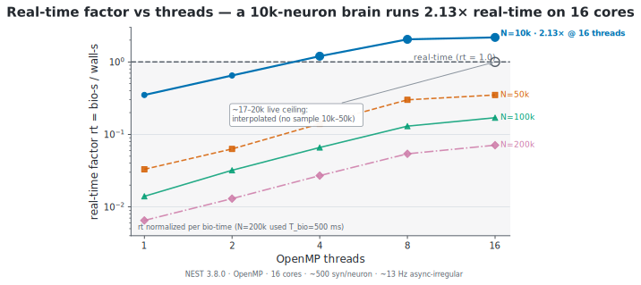

# Does NCP bottleneck NEST? — performance review

**Short answer: no, not inherently — once one real bottleneck (now fixed) is out
of the way.** NEST only advances simulation time *during* `nest.Run(chunk)`;
between chunks NCP does its work (read recorders, serialize, transport, inject
stimulus). So the effective throughput is

```
effective_rate ≈ chunk_ms / (T_run + T_ncp)
```

NCP is a bottleneck only if its per-chunk overhead `T_ncp` is comparable to or
larger than the integration time `T_run`. For a **rate-coded control loop** `T_ncp`
is small and bounded; the dominant term is `T_run` — the simulation itself, which
NCP neither can nor should change.

## The one real bottleneck — found and fixed

The reference NEST backend's `step` previously called `device.get("events")` for
**every** record port on **every** step and sliced `[last:]`. `get("events")`
materialises the recorder's **entire history** each call, so per-step cost grew
**O(total events recorded)** — linearly with run length. A 10-minute control loop
at 50 Hz would slow to a crawl (and balloon memory) purely from re-copying spike
history, even though each step only needs the last chunk. This *would* have
throttled NEST as the loop fell behind real time.

Fixed (in the reference NEST backend's `step`):
- **`RATE`** (the common control observable): difference the **`n_events`
  counter** — **O(1)** per step, no events array at all (the proven
  count-delta control-loop pattern).
- **`SPIKES` / `V_m`**: fetch the events, return the `[last:]` tail, then
  **best-effort drain** the recorder (`set(n_events=0)`) so the next read is
  **O(new)**; if the NEST build doesn't support clearing, fall back to index
  tracking (correct, but the array keeps growing — prefer `RATE` for long loops).

Result: per-step readback is **O(1)** for rate and **O(new events)** for spikes/V_m
— bounded, independent of run length.

## Per-tick cost model (after the fix)

| Term | Cost | Notes |
|---|---|---|
| stimulus inject (`generator.set`) | O(#stimulus ports), µs | a few `set()` calls |
| **`nest.Run(chunk)`** | **dominant; model-size dependent** | the science; NCP doesn't touch it |
| readback | **O(1)** rate / **O(new)** spikes-V_m | was O(history) — fixed |
| encode/decode (codec) | negligible | linear rate map |
| serialize | rates: tens of bytes; raw spikes: O(events) | **prefer rate for the loop**; raw spikes are the analysis path. JSON frame ser/de is **~0.2–0.5 µs** (measured — see [NCP's own per-tick overhead](#measured-ncps-own-per-tick-overhead-rust-release)) |
| transport | in-proc ~µs · Zenoh SHM ~tens µs · Zenoh/loopback ~0.1 ms · WS+JSON ~0.2–1 ms | far below a 20–50 Hz (20–50 ms) budget |

For a UAV outer-loop (20–50 Hz) with rate-coded I/O, `T_ncp` is sub-millisecond
and **`T_run` dominates**. NCP adds no meaningful slowdown.
## Measured: NCP's own per-tick overhead (Rust, release)

The sections above ask whether NCP slows *NEST*. The complementary question a
fleet integrator asks is whether NCP itself — the contract, the codec, the safety
gate — is heavy. It is not, and the word "negligible" in the cost model above now
has a number behind it. [`ncp-core/examples/overhead.rs`](ncp-core/examples/overhead.rs)
times the exact hot-path operations a controller runs **every tick** — JSON
(de)serialization of the action/perception frames, the safety governor, and the
reflex controller — on the **release** build, with warmup and `black_box` to
defeat dead-code elimination.

| hot-path op (per tick)                | cost   | frame size |
|---------------------------------------|--------|------------|
| `CommandFrame` serialize (serde_json) | 248 ns | 215 B      |
| `CommandFrame` deserialize            | 446 ns | 215 B      |
| `SensorFrame` serialize               | 223 ns | 195 B      |
| `SensorFrame` deserialize             | 474 ns | 195 B      |
| `SafetyGovernor::govern`              | 140 ns | —          |
| `ReflexController::step`              | 134 ns | —          |

A full closed-loop tick — deserialize the inbound `SensorFrame`, step the reflex
controller, run the safety governor, serialize the outbound `CommandFrame` — sums
to **≈1 µs** of CPU (474 + 134 + 140 + 248 ≈ 996 ns). Frames are **≈200 bytes** on
the JSON action/perception planes. Transport then adds the per-hop term from the
cost model: **≈0.1 ms** on a Zenoh loopback hop, **tens of µs** over shared memory,
~µs in-process.

> **Reproduce:** `cargo run -p ncp-core --release --example overhead`
> (`--release` is load-bearing — a debug build is 10–50× slower and not
> representative of shipped overhead). This is the repo's first committed Rust
> overhead bench; the three NEST-side Python benchmarks are documented under
> [Benchmark methodology & reproducibility](#benchmark-methodology--reproducibility).

This also confirms why **JSON is the right runtime default** (see
[`RATIONALE.md`](RATIONALE.md)). At ≈1 µs/tick the serializer is nowhere near the
bottleneck, and JSON stays human-readable on the wire and trivially debuggable.
The protobuf schema in [`proto/ncp.proto`](proto/ncp.proto) (+ `gen/rust`) is the
**contract / conformance source-of-truth**, *not* the shipped runtime encoding —
the `prost` bindings are not compiled into the runtime path. Binary protobuf would
be worth negotiating only as an opt-in for a kHz / bandwidth-constrained consumer.
The one binary path that *is* shipped is the bulk observation codec (`BulkBlock`),
which `overhead.rs` also measures as more compact than JSON for the same numeric
array (≈2× smaller with `f32`/`i32` columns) — and it is carried **only** on the
analysis plane, never the hot action loop.

### Is NCP unnecessary overhead?

**No — and it is now quantified.** A control loop runs at 20–1000 Hz, i.e. a
**50 ms → 1 ms** budget per tick. NCP's own per-tick CPU cost is **≈1 µs**, so the
NCP tax is a vanishing fraction of that budget:

| control rate | period | NCP CPU tax (≈1 µs) |
|--------------|--------|---------------------|
| 20 Hz        | 50 ms  | ≈0.002 %            |
| 100 Hz       | 10 ms  | ≈0.01 %             |
| 1000 Hz      | 1 ms   | ≈0.1 %              |

Transport is a separate, deployment-dependent term: a Zenoh loopback hop
(≈0.1 ms) is comfortable up to a few hundred Hz; at kHz rates co-locate the
controller in-process (~µs) or use SHM (tens of µs). Either way the dominant cost
in a neuro-cybernetic loop is the **simulation / in-sim compute** (`nest.Run`, the
NEST kernel) and — for a networked fleet — the **transport hop**, not NCP's
serialize-and-check.

What that ≈1 µs buys is the entire point: a stable cross-language **contract**
(one wire shape shared by Engram, crebain, and prisoma), per-tick **safety
gating** (`SafetyGovernor`: speed / geofence / timeout / health), and a generic
**hub-interop** surface so Engram can drive a UAV or a robot through the same
three planes. Deleting NCP would not reclaim a meaningful slice of the loop
budget — it would only delete the contract and the safety gate. So NCP is **not**
unnecessary overhead: it is a sub-microsecond tax for the safety and interop that
make a multi-consumer fleet possible.

### Top safe optimization: zero-copy publish (ZBytes/SHM)

The highest-value **safe** (non-wire-breaking) optimization on the transport side
is in [`ncp-zenoh`](ncp-zenoh): `ZenohBus::put` copies the payload on **every**
publish.

```rust
// ncp-zenoh/src/lib.rs:441
self.session.put(key, payload.to_vec())   // clones an already-owned Vec<u8>
```

The caller (`send_command` / `publish_command` / RPC) already owns the serialized
`Vec<u8>`; `payload.to_vec()` clones the whole frame a second time for nothing.
Moving the owned buffer into Zenoh `ZBytes` — e.g. a
`put_owned(key, payload: Vec<u8>, plane)`, or making `put` generic over
`impl Into<ZBytes>` — removes one alloc+copy of the full frame per publish with
**no change to the wire bytes**. It is also the prerequisite for true SHM
**zero-copy** delivery on the action plane: a `to_vec()` into a fresh heap `Vec`
cannot be handed to the shared-memory path without a copy, so this single change
unblocks the zero-copy fast path the QoS layer is already set up for. At ≈200 B /
frame the copy is cheap in absolute terms, but it is pure waste on the
latency-critical action loop and trivially removable. JSON stays the debuggable
default; this is an encoding-neutral transport win.

This and 34 other audited findings are catalogued in
[`KNOWN_LIMITATIONS.md`](KNOWN_LIMITATIONS.md) (3 high-severity, incl. a `bulk.rs`
decode OOM/DoS, an unbounded / `+Inf` `ttl_ms` fail-**open** watchdog, and an
empty-position geofence bypass). **None are fixed yet** — they are conservative,
tracked proposals, because NCP is a shared contract.


## Secondary considerations (not bottlenecks, documented)

- **Hot loop bypasses the gateway.** The streaming control plane is
  `ZenohControlTransport` pub/sub (sensor→command); it does **not** go through the
  gateway's per-request RPC. The gateway's localhost-TCP-per-request is only the
  *rare* lifecycle RPC (open/close); it is not on the per-tick path. (Connection
  reuse there is a possible micro-optimisation, not a bottleneck.)
- **WebSocket single-thread executor.** The reference WebSocket endpoint runs
  `handle_json` on one shared worker thread — this serialises all connections'
  NEST work, which is *correct* (one global NEST kernel) and keeps the event loop
  free; it is not an added bottleneck (NEST is single-kernel regardless).
- **Raw spike streaming** at high rate produces large JSON. Use `RATE`/counts for
  the control loop; stream raw spikes only on the observation/analysis plane
  (an analysis/observer client), which is loss-tolerant.
- **Bulk column codec for the observation plane (#6).** When raw spikes/V_m traces
  *are* streamed on the analysis plane, the JSON/`repeated double` serialize cost
  scales O(events) (~11 ms for 50k spikes). `ncp-core::bulk` packs those arrays as
  a self-describing little-endian **column block** (proto `BulkObservation.block`):
  fixed-width, parse-free (bulk `copy_from_slice`, no tokenizer), random-access via
  a column directory, and ~2× smaller with the `f32`/`i32` column widths. It is an
  additive, negotiated wire option carried **only** on the observation/analysis
  plane — never the hot action loop (Sensor/Command stay JSON/protobuf). The
  canonical JSON `ObservationFrame` remains the always-available representation.

## Compared with SOTA (June 2026)

Runtime exchange with a live simulator has *inherent* per-tick overhead in every
scheme — MUSIC services its ports each MPI tick, NRP-core marshals DataPacks per
step, the NEST Server does a REST round trip. NCP's chunked `Prepare`/`Run` +
**delta readback** is the standard pattern, and after this fix its readback is the
same **O(new)** MUSIC achieves. The one structural difference is the transport
hop — and the common intuition about it is **backwards**: MUSIC is not a
low-microsecond shared-memory hop. It exchanges over **buffered pairwise
`MPI_Send`/`MPI_Recv`** ([Djurfeldt et al. 2010, PMC2846392](https://pmc.ncbi.nlm.nih.gov/articles/PMC2846392/)),
and its *closed-loop* latency is buffering/tick-bound: ≈**70 ms at a 1 ms tick** rising
to ≈**350 ms at a 50 ms tick** ([Weidel et al. 2016, *Front. Neuroinform.* 10:31](https://www.frontiersin.org/articles/10.3389/fninf.2016.00031/full)).
NCP's per-exchange transport (≈0.1 ms Zenoh loopback, ≈0.2–1 ms WS+JSON) is one to two
orders of magnitude **under** that floor, so on a single closed-loop reaction NCP is
**not** slower than MUSIC — if anything faster. MUSIC's genuine edge is multi-simulator
shared-clock co-simulation and bulk intra-HPC spike throughput (see
[`NEST_REALTIME.md`](NEST_REALTIME.md)), not single-loop latency. The honest asymmetry
that favours MUSIC is structural, not transport: NCP pays a per-chunk PyNEST/SLI
round-trip (~0.1 ms host overhead) because Python is NEST's only binding — a soft
`chunk_ms` floor of ≈1–2 ms in the small-network regime that MUSIC's C++/MPI tick lacks
(it bites only below ~2 ms ticks on tiny networks). NCP competes on portability, safety,
provenance, and observability — and cedes no closed-loop-latency crown to MUSIC.

Nor does NCP claim a latency edge over a tuned ROS 2/DDS stack: in single-machine
64-byte ping-pong, Cyclone DDS reaches ~8 µs (UDP multicast) versus Zenoh-p2p
~10 µs (zenoh-pico ~5 µs) ([Liang et al. 2023, arXiv:2303.09419](https://arxiv.org/abs/2303.09419)).
NCP chooses
Zenoh for its **features** — per-plane QoS, shared memory, data-centric P2P
discovery, fleet many-to-many — not raw intra-host latency. The broader measured
lesson holds across every neuro-robotic system: inter-process **transport**, not
in-simulator or on-chip compute, dominates loop latency (even on-chip neuromorphic
loops are bottlenecked by per-timestep host↔board spike transfer), which is why
NCP invests in transport QoS rather than claiming a speed record.

## Measured: chunk overhead, scaling, and I/O overlap (NEST 3.8.0, 16 cores)

The cost model above predicts `T_ncp` is small and `T_run` dominates. Three
benchmarks confirm it and bound where NCP's design choices actually matter.
Reproduce with [`scripts/bench_chunk_overhead.py`](scripts/bench_chunk_overhead.py),
[`scripts/bench_realtime.py`](scripts/bench_realtime.py), and
[`scripts/bench_overlap.py`](scripts/bench_overlap.py); full sizing table in
[`NEST_REALTIME.md`](NEST_REALTIME.md) and full methodology in
[Benchmark methodology & reproducibility](#benchmark-methodology--reproducibility)
below.

### Per-chunk readback overhead — already ~free

The earlier readback fix (above) made per-step readback **O(1)** for rate and
**O(new events)** for spikes/V_m. The real-time sweep recorded from a 1000-neuron
readout subset (an NCP `RecordSpec`) and saw recording overhead stay negligible —
the measured numbers are raw integrate + spike-delivery throughput, not dominated
by readback. The control-observable path is not the bottleneck; `T_run` is.

### Scaling: the binding constraint is the real-time factor

A Brunel-style balanced net (~500 syn/neuron, ~13 Hz async-irregular) reaches
**>=1x real time only at N=10000 and only at >=4 threads** (T=4 1.18x, T=8 2.01x,
T=16 2.13x). No N>=50000 config reaches real time on 16 cores (best N=50000 T=16 =
0.35x). Since indegree is fixed, synapses and per-step compute scale ~linearly with
N, so `rt` degrades ~linearly with N. Thread efficiency peaks in the **4–8 band**
(super-linear, cache-driven: N=50000 T=8 efficiency ~1.12) and collapses to ~0.66
at T=16 — 16 threads still helps absolute wall time but with diminishing returns.
**Practical live ceiling at 16 threads / ~13 Hz / ~500 syn/neuron: ~10k–20k
neurons.** Implication for `chunk_ms`: shrinking it buys latency, not throughput,
and while compute-bound it makes things *worse* (per-`Run()` overhead climbs — at a
10 ms chunk on a 50k net, ~10 ms of bio time cost ~38–65 ms of compute). If real
time at large N is the goal, the lever is **fewer-but-larger chunks / more threads /
a smaller net**, not a smaller chunk.

<picture>
  <source media="(prefers-color-scheme: dark)"  srcset="docs/plots/realtime_dark.svg">
  <source media="(prefers-color-scheme: light)" srcset="docs/plots/realtime_light.svg">
  
</picture>

<sub>**Real-time factor vs threads** (`rt = bio-s / wall-s`, log–log). Only the 10k-neuron net clears the dashed `rt = 1.0` line (1.18× → 2.13× over 4–16 threads); larger nets stay offline (best 0.35× at N=50k, T=16). `rt` degrades ~linearly with N; the ~10–20k live ceiling is interpolated (no sample between 10k and 50k). Regenerate with [`scripts/plot_perf.py`](scripts/plot_perf.py).</sub>

### I/O overlap: the GIL blocks *Python* threads, not *native* threads

Two GIL tests settle where transport must live. (1) A background spinner thread
retained only **~0.4–1.3% of its standalone counting rate during a real
`nest.Run()`** — `nest.Run()` holds the Python GIL for essentially its full
duration (`gil_released=false`). (2) So a `ThreadPoolExecutor` "overlap" loop (a
*Python* worker) yields only **~0.92–1.10× (noise)** — no real overlap, because the
worker can only run during NEST's brief internal GIL releases.

But the GIL only blocks **Python** threads. A **native OS thread** — a Rust
`std::thread`, a PyO3 background thread, or (in the measurement) a C `pthread` via
`ctypes` — never holds the GIL, so it runs transport *concurrently with*
`nest.Run()`. Measured wall-clock with a `ctypes` off-GIL busy-spin transport stand-in
(8000-neuron net, ~8 ms compute and 10 ms transport-work per 20 ms chunk, 30 chunks;
[`scripts/bench_gil_overlap.py`](scripts/bench_gil_overlap.py)):

| overlap mechanism                              | wall    | speedup |
| ---------------------------------------------- | ------- | ------- |
| serial (`Run`, then transport)                 | 0.586 s | 1.00×   |
| **native thread** (C / Rust / PyO3) during `Run` | **0.348 s** | **1.68×** |
| Python thread during `Run`                     | 0.541 s | 1.08×   |

<picture>
  <source media="(prefers-color-scheme: dark)"  srcset="docs/plots/overlap_dark.svg">
  <source media="(prefers-color-scheme: light)" srcset="docs/plots/overlap_light.svg">
  
</picture>

<sub>**The I/O-overlap ceiling, read honestly.** Left: the analytic ceiling `(compute+work)/max(compute,work)` falls from 1.80× at 10 ms transport-work to ~1.01× at 0.1 ms — at a sub-ms rate-loop `T_ncp` the gain is single-digit-%. Right: the 1.68× native-thread bar is **hatched** because it is an idealized off-GIL `ctypes` ceiling, *not* a measured transport result; a naive Python-serialize thread lands at 1.08×. Regenerate with [`scripts/plot_perf.py`](scripts/plot_perf.py).</sub>

**So the fix for the GIL is a native thread, not a different language.** Two ways:
(a) **the Rust NCP gateway / a separate process** ([`ncp-gateway`](ncp-gateway) /
[`ncp-zenoh`](ncp-zenoh)) — recommended; its OS threads run outside the GIL and it
also isolates the loop from Python GC jitter; or (b) an **in-process PyO3 background
thread** that owns serialization + Zenoh publish and overlaps the next `Run`. (A
third option — releasing the GIL inside PyNEST via Cython `with nogil` — would also
work but means patching/rebuilding NEST upstream.) Either way, transport ships chunk
N-1 / buffers chunk N+1 while the NEST process computes chunk N.

> **Read the 1.68× honestly — it is an idealized *ceiling*, not a measured transport
> result.** The "transport work" in `bench_gil_overlap.py` is a `ctypes` busy-spin that
> runs 100% in C and never touches the GIL — the most optimistic possible stand-in. The
> 1.68× therefore holds **only if the real serialize is *also* off-GIL** (Rust `serde` /
> a PyO3 worker that releases the GIL). A naive `threading.Thread` whose body is Python
> serialization (e.g. Pydantic `model_dump`) lands at the **~1.08×** Python-thread row,
> not 1.68× — so option (b) above **must serialize in Rust**, not Python. And the gain
> is contingent on `T_transport ≈ T_run`: the overlap speedup falls off from its analytic
> ceiling `(compute+work)/max(compute,work)` ≈ **1.80× at 10 ms-work** (measured 1.68×)
> → ~1.07× at 0.6 ms → ~1.01× at 0.1 ms, so at rate-loop `T_ncp` (sub-ms) the
> real benefit is single-digit percent, not 68%.
>
> **What engram actually deploys:** the in-process Python NEST path
> (`backends.py::NestSession.step` → `loop.py::NeuroControlLoop.tick`) is **strictly
> serial** on one thread — `Run`, then read, then send, in sequence. There is no Python
> `ZenohControlTransport` and no PyO3 background thread; the realized native-thread
> overlap lives **only** in the separate Rust `ncp-zenoh`/`ncp-gateway` process. That is
> **fine for the rate-coded loop** (`T_ncp` sub-ms ≪ `T_run`), and is the standing
> ceiling **only** for high-rate raw-spike/`V_m` streaming, where serialize is O(events)
> (~11 ms / 50k spikes) and rivals `T_run`. If that workload ships, route **only the
> observation plane** through the off-GIL Rust `ncp-zenoh` bulk column codec and batch
> generator updates into one `nest.SetStatus`; keep the control loop serial. (Do **not**
> reach for free-threaded CPython: importing today's NEST under 3.13t/3.14t re-enables
> the GIL process-wide and buys nothing for the OpenMP kernel.)

Caveat: overlap only *helps* when transport work is comparable to per-chunk compute
(the real-time regime). For a compute-bound heavy net it is moot (best honest case
stayed ~55 ms period at chunk_ms=10); the lever there is the real-time factor.

(Both overlap experiments are committed and reproducible —
[`scripts/bench_gil_overlap.py`](scripts/bench_gil_overlap.py) (native-vs-Python
thread) and [`scripts/bench_overlap.py`](scripts/bench_overlap.py) (serial-vs-threaded
loop). Absolute periods are machine/load-dependent; the load-bearing, reproducible
result is the native-≫-Python-thread gap, not the absolute milliseconds.)

## Benchmark methodology & reproducibility

All three benchmarks are committed, parameterized scripts. A third party can
reproduce every number below from the repo. This section documents, for each:
what it measures, the exact network, the timing protocol, the correctness checks,
the command, the environment, and the known caveats.

### Shared environment, protocol & caveats

* **Hardware / OS:** 16 physical cores, 128 GB RAM (the reference machine).
* **Simulator:** **NEST 3.8.0**, OpenMP-only, single MPI rank. CLAUDE.md pins the
  project target at NESTML 8.2.0 → **NEST 3.9**; the absolute hardware-specific
  *timings* may shift slightly on 3.9, but the load-bearing **GIL verdict does not**:
  `nest.Run()`/`Simulate()` holds the CPython GIL identically on 3.8.0, **3.9, and
  3.10** — source-confirmed (no `with nogil` around `pEngine.execute` in
  `pynestkernel.pyx`, nor around `run(t)` in 3.10's `nestkernel_api.pyx`; 3.10 even
  rewrote PyNEST from SLI to a direct C++ API and still added none). Each script
  prints `nest.__version__` so reproductions are self-labelling; run
  [`scripts/verify_nest_chunking.py`](scripts/verify_nest_chunking.py) to re-confirm
  the chunking/equivalence claims on your 3.9 build.
* **Build is excluded from the timer.** Network construction (`Create`/`Connect`)
  runs *outside* `perf_counter`; only the simulate phase is timed. (Build is itself
  characterized in [`NEST_REALTIME.md`](NEST_REALTIME.md): ~linear in synapse count,
  the *emerging* limiter at very large N, but never inside the reported wall.)
* **Warmup + reps + MIN.** Every config gets ≥1 untimed warmup rep (first-touch
  allocation, JIT/cache warm) then N timed reps; the **MIN wall** is the headline
  (least-contended sample), with median also reported where relevant. MIN is the
  honest "best achievable" number and is the standard for noisy micro-timing.
* **Determinism where it gates correctness.** The chunk benchmark uses
  `local_num_threads = 1` and a fixed `rng_seed` so its bit-identical equivalence
  check is meaningful. (The realtime/overlap sweeps vary threads on purpose and do
  not require cross-thread bit-identity.)
* **Run a NEST-enabled interpreter DIRECTLY, not via `conda run`.** `conda run`
  fully buffers child stdout when redirected, so per-row streaming progress never
  appears. Invoke the NEST-enabled Python directly with `-u`, e.g.
  `python -u scripts/bench_*.py` (point at your env's interpreter). The `-u`
  forces unbuffered stdout. Each script also exits with a clear **"REQUIRES NEST"**
  message if `import nest` fails.
* **General caveats:** few-reps timing is noisy on tiny signals (sub-millisecond
  per-chunk costs); the realtime frontier's ~17k–20k crossing is *interpolated*
  (no sample between 10k and 50k); firing-regime and fixed-indegree assumptions are
  stated per benchmark and the numbers do not transfer outside them.

### 1. Chunk overhead — [`scripts/bench_chunk_overhead.py`](scripts/bench_chunk_overhead.py)

* **Measures:** the per-chunk cost of NCP's stepwise control model — monolithic
  `Run(T_bio)` vs **chunked-efficient** (`Prepare()` once → `Run(chunk)` in a loop
  → `Cleanup()`, the NCP pattern, kernel state persists) vs **chunked-naive**
  (`nest.Simulate(chunk)` per chunk, the anti-pattern that re-`Prepare`/`Cleanup`s
  every chunk), swept across chunk sizes.
* **Network:** `iaf_psc_alpha`, 10000 neurons (8000 E / 2000 I), **sparse**
  recurrent connectivity (`fixed_total_number`, 4000 synapses; E sources 80% / I
  sources 20% of the budget; inhibition `-g·w`, g=5). One `poisson_generator`
  (8000 Hz default) drives all neurons → real, identical spiking compute across
  every config. A `spike_recorder` on all neurons supplies the equivalence check.
  Sparse-on-purpose: keeps recurrent delivery cheap so the timer reflects
  per-`Run()` overhead rather than synaptic compute.
* **Timing protocol:** `local_num_threads=1`, fixed `rng_seed`; the network is
  **rebuilt fresh (untimed) before every rep**; 1 untimed warmup + 5 timed reps
  per config; **MIN wall** reported; slowdown = `min_config / min_monolithic`.
* **Correctness / equivalence check:** because kernel state persists across
  `Run(chunk)`, monolithic and **all** chunked-efficient reps must produce
  **bit-identical total spike counts** for the fixed seed. The script asserts this
  (`--strict` → non-zero exit on any divergence). chunked-naive is timing-only and
  excluded from the equivalence set (each `Simulate` tears down/rebuilds).
* **Command:**
  ```bash
  python -u scripts/bench_chunk_overhead.py \
      --neurons 10000 --synapses 4000 \
      --chunk-ms 100 50 20 10 5 2 1 --t-bio-ms 1000 --reps 5 --strict
  ```
  (Smoke test: `--neurons 200 --synapses 100 --chunk-ms 100 10 --t-bio-ms 100
  --reps 2`.) On the sparse 10k net the per-`Run()` overhead is small and the
  equivalence check passes (bit-identical spike counts mono ↔ chunked-efficient);
  chunked-naive is the slowest. The takeaway matching the cost model: on a
  *compute-bound* net, shrinking the chunk adds per-`Run()` overhead without
  changing throughput (see the 50k-net 10 ms-chunk figure above).

### 2. Real-time factor & sizing — [`scripts/bench_realtime.py`](scripts/bench_realtime.py)

* **Measures:** the real-time factor `rt = bio_time / wall_time` of a NEST network
  vs network size N and thread count — the binding constraint for a live loop
  (`rt ≥ 1` ⇒ can be driven faster than real time).
* **Network:** Brunel-style balanced random net (the NEST standard scaling
  benchmark): `iaf_psc_alpha`, 0.8N E / 0.2N I, **fixed indegree** held constant
  across N (`fixed_indegree`, CE=400 from E, CI=CE/4=100 from I ⇒ ~500 recurrent
  syn/neuron), inhibition-dominated (g=5), per-neuron `poisson_generator` tuned for
  an async-irregular **~13 Hz** regime. A `spike_recorder` reads back only a
  1000-neuron readout subset (mimics an NCP `RecordSpec`; recording overhead
  negligible). Fixed indegree ⇒ synapses and per-step compute scale ~linearly with
  N, so `rt` degrades ~linearly with N.
* **Timing protocol:** `local_num_threads` set **before** node creation (required
  by NEST); build outside the timer; only `nest.Simulate(T_bio)` timed; one untimed
  warmup, then up to 3 timed reps with the **MIN wall** reported;
  `rt = (T_bio_ms/1000) / min_wall_s`. Reps exceeding a 60 s skip threshold stop
  after one timed rep (large-N budget guard).
* **Correctness check:** firing rate is reported per cell and confirmed
  N/T-invariant (12.3–13.5 Hz across the whole grid), verifying the regime did not
  drift across sizes/threads. The full sizing table + thread-efficiency analysis is
  in [`NEST_REALTIME.md`](NEST_REALTIME.md).
* **Command:**
  ```bash
  python -u scripts/bench_realtime.py \
      --n 10000 50000 100000 200000 --threads 1 2 4 8 16 \
      --t-bio-ms 1000 --reps 3
  ```
* **Caveats:** the ~17k–20k live ceiling at T=16 is **interpolated** (no sample
  between 10k and 50k); `fire_hz` comes from the first-rep event count, not the
  min-wall rep (harmless — rate is N/T-invariant); N≥200000 uses a shortened
  `T_bio` with `rt` scaled to its own bio time.

### 3. I/O overlap & GIL test — [`scripts/bench_overlap.py`](scripts/bench_overlap.py)

* **Measures:** (a) whether `nest.Run()` releases the Python GIL, and (b) whether
  in-process Python threading can overlap NCP transport I/O with NEST compute.
* **Network:** Brunel-style `iaf_psc_delta`, default N=5000 (0.8/0.2 E/I),
  `fixed_indegree` CE=100 / CI=25, g=5, `poisson_generator` 20000 Hz, `Prepare()`'d
  once for chunked `Run()`. (Lighter `iaf_psc_delta` net so per-chunk compute is in
  the same ballpark as the modeled I/O, to actually exercise the overlap question.)
* **GIL-test method (decisive):** a background **spinner thread** increments a
  counter in a tight Python loop. First measure its *standalone* counting rate over
  0.3 s (baseline). Then start a fresh spinner and call a real `nest.Run(run_ms)`;
  measure the counter's rate *during* the Run. The **retained fraction** =
  during/baseline. A GIL that was **released** during Run would let the spinner keep
  **>50%** of baseline; a GIL **held** for Run's full duration starves the spinner
  to **~0%**. Measured on NEST 3.8.0: **~0.4–1.3% retained ⇒ `nest.Run()` HOLDS the
  GIL** (`gil_released=false`).
* **Overlap-loop method:** a chunked `Run` loop run two ways with the **same total
  work** (same chunk count, same per-chunk serialize-I/O): (a) **serial** —
  `serialize_io(); Run()` per chunk; (b) **overlapped** — a `ThreadPoolExecutor`
  (1 worker) that submits `serialize_io(chunk N)` and calls `Run(chunk N+1)` on the
  main thread, joining the previous future each iteration. `serialize_io` does a
  **real JSON round-trip** (`json.loads(json.dumps(...))` of a `CommandFrame` and a
  `SensorFrame`) **plus** a modeled transport RTT via `time.sleep(io_ms/1000)`,
  swept over several `io_ms`. Speedup = `serial_period / overlapped_period`; ~1.0×
  means no real overlap. Measured: **0.92–1.10× across all cases (noise)** — because
  under the held GIL the worker cannot serialize while `Run` owns the interpreter.
  Conclusion: transport must live in a **separate process** (the Rust gateway,
  OS threads outside the GIL), not the NEST interpreter.
* **Command:**
  ```bash
  python -u scripts/bench_overlap.py \
      --n 5000 --threads 16 --chunk-ms 10 --t-bio-ms 1000 --io-ms 0.5 2 5
  ```
* **Caveat (reproduction provenance):** the original `bench_overlap.py` prototype
  was deleted after its first run and reconstructed. The reconstruction reproduces
  the **qualitative verdicts** (GIL held; threaded overlap ~1.0×) but absolute
  per-chunk-compute magnitudes differ by >2× because the exact original Poisson
  drive was unknown. The load-bearing findings, not the absolute periods, are what
  reproduce.

## What to measure on your hardware

1. `T_run` for your network at your `chunk_ms` — this sets the feasible rate.
2. Readback cost (now O(1)/O(new)) and end-to-end tick time.
3. **p99 jitter**, not mean — the thing a control loop actually cares about.
4. Then pick `chunk_ms` for your latency/throughput point (as you would a MUSIC tick).

## Honest remaining items

- The spikes/V_m **drain is best-effort** — confirm `set(n_events=0)` clears on
  your NEST 3.9 build; otherwise that path stays O(history) (use `RATE`).
- Large-population multimeter recording is intrinsically heavy regardless of NCP;
  record from a representative subset (the backend already pins V_m to one neuron).
- A full adversarial audit of NCP (correctness, safety, robustness, overhead) is
  catalogued in [`KNOWN_LIMITATIONS.md`](KNOWN_LIMITATIONS.md) — **35 findings, 3
  high-severity**. They are **proposals, not yet applied**; treat that file as the
  live risk register, not a list of fixed bugs. The top *performance* item there
  (the `ncp-zenoh` `payload.to_vec()` copy) is discussed in
  [Top safe optimization](#top-safe-optimization-zero-copy-publish-zbytesshm) above.
